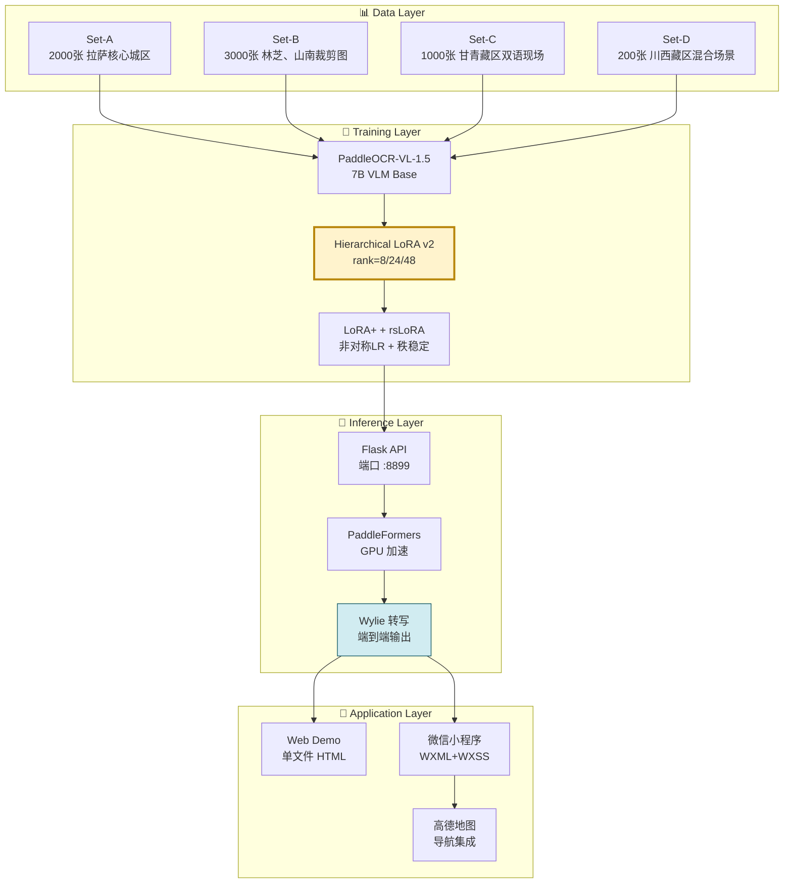
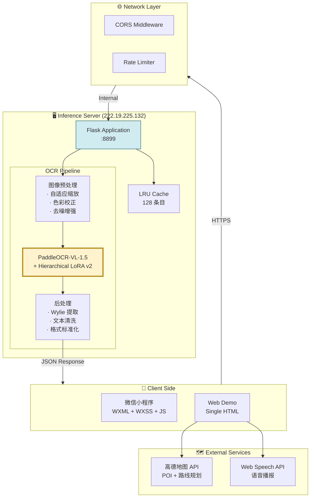
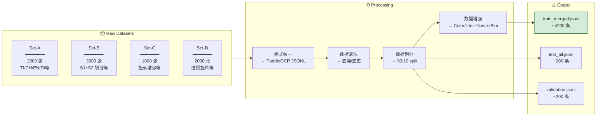
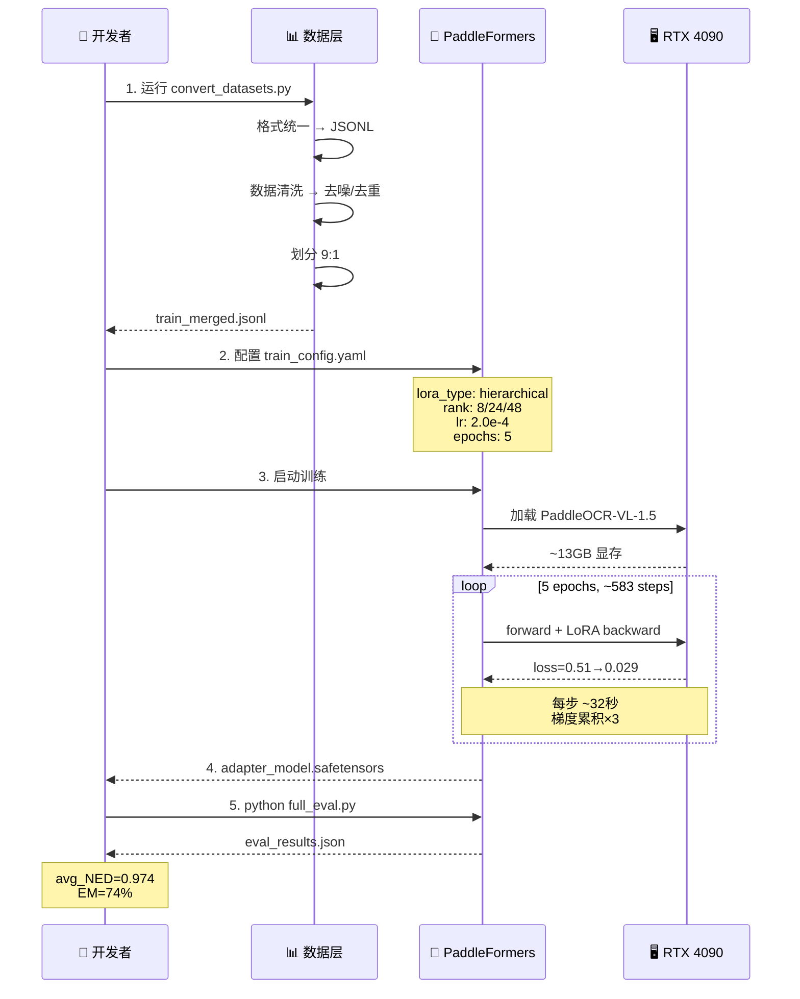
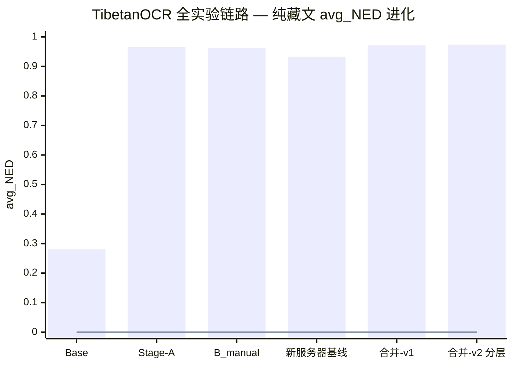
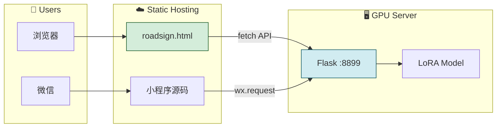
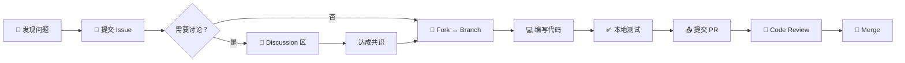
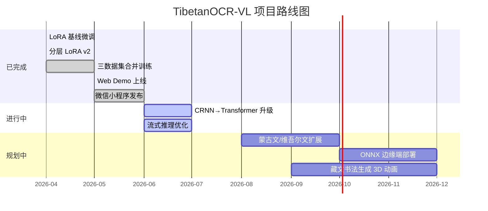

# TibetanOCR-VL — 藏文多语言 OCR 视觉语言模型微调项目

<div align="center">

**开发文档 v2.0 | 全链路可复现 | 生产级部署指南**

[](https://www.python.org/)
[](https://www.paddlepaddle.org.cn/)
[](LICENSE)
[](#)
[](https://www.nvidia.com/)
[](#)

</div>

---

## 目录

- [0. 项目速览](#0-项目速览)
- [1. 系统架构设计](#1-系统架构设计)
- [2. 环境搭建与可复现性保障](#2-环境搭建与可复现性保障)
- [3. 数据工程流水线](#3-数据工程流水线)
- [4. 模型训练全流程](#4-模型训练全流程)
- [5. 模型评测体系](#5-模型评测体系)
- [6. 推理服务 API 文档](#6-推理服务-api-文档)
- [7. 微信小程序集成指南](#7-微信小程序集成指南)
- [8. Demo 部署完整方案](#8-demo-部署完整方案)
- [9. 社区贡献指南](#9-社区贡献指南)
- [10. 故障排查手册](#10-故障排查手册)
- [11. 版本履历与路线图](#11-版本履历与路线图)
- [A. 附录](#a-附录)

---

## 0. 项目速览

### 0.1 一句话描述

> 基于 PaddleOCR-VL-1.5 视觉语言大模型，采用分层分级 LoRA 微调策略，实现藏文/多语言混合场景 OCR 识别，配套微信小程序 Demo 与 Flask 推理服务，提供端到端的可复现训练-评测-部署全链路。

### 0.2 核心指标

| 指标 | 基线 (Base) | 分层 LoRA v2 | 提升幅度 |
|------|:----------:|:----------:|:------:|
| **纯藏文 avg_NED** | 0.282 | **0.974** | **+245%** |
| **纯藏文 Exact Match** | 1.5% | **74.0%** | **+72.5pp** |
| **多语言 avg_NED** | 0.278 | **0.949** | **+241%** |
| **多语言 Exact Match** | 4.5% | **65.0%** | **+60.5pp** |
| **可训参数量** | — | 134M (1.9% of 7B) | 极致轻量 |
| **训练时长** | — | ~5.2h (双卡 4090) | 低成本 |

### 0.3 技术栈总览



### 0.4 快速开始（3 分钟体验）

```bash
# 1. 克隆仓库
git clone <repo-url> && cd TibetanOCR-VL

# 2. 安装依赖（推荐使用提供的 Docker 镜像）
docker pull paddleocr-vl-tibetan:latest
docker run --gpus all -p 8899:8899 paddleocr-vl-tibetan:latest

# 3. 测试推理
curl -X POST http://localhost:8899/ocr \
  -H "Content-Type: application/json" \
  -d '{"image": "'$(base64 -w0 demo.jpg)'"}'

# 4. 打开 Web Demo
open http://localhost:8899/demo
```

---

## 1. 系统架构设计

### 1.1 总体架构



### 1.2 分层 LoRA 架构详解

模型按功能分为三个层级：

```
Layer  0 ████ r=8  ───────────────────────┐
Layer  1 ████ r=8                          │
  ...   ...                                ├─ Shallow (MLP*2)
Layer 10 ████ r=8                          │  · attn only (q,k,v,o)
                                           │  · LoRA+ λ=1.5
Layer 11 ████████████ r=24  ──────────────┐│  · ~8.8M params
  ...      ...                            ││
Layer 21 ████████████ r=24                │├─ Middle (LM layer0)
                                           ││  · attn + MLP (gate,up,down)
Layer 22 ████████████████████ r=48  ─────┐││  · LoRA+ λ=2.0
  ...      ...                           ││├─ · ~44.0M params
Layer 31 ████████████████████ r=48       │││
                                          ││├─ Deep (LM layer0)
                                          │││  · attn + MLP (gate,up,down)
                                          │││  · LoRA+ λ=2.5
                                          │││  · ~81.0M params
                                          │││
                                          ┘││
                                           ┘│
                                            ┘
```

### 1.3 设计决策记录 (ADR)

| ID | 决策 | 理由 | 替代方案 |
|----|------|------|---------|
| ADR-001 | 选用 PaddleOCR-VL-1.5 而非通用 VLM | 原生 OCR 能力，支持端到端文本输出 | Qwen-VL, InternVL |
| ADR-002 | LoRA 微调而非全量微调 | 训练成本 ~1.9%，部署灵活，避免灾难性遗忘 | Full Fine-tune, QLoRA |
| ADR-003 | 分层 rank (8/24/48) 而非均匀 rank | 浅层视觉通用特征 < 深层任务特定特征 | 均匀 r=16, r=48 |
| ADR-004 | Wylie 转写输出而非 Unicode 藏文 | 避免 Unicode 编码歧义，与下游翻译模块解耦 | 直接输出 Unicode 藏文 |
| ADR-005 | rsLoRA (α/√r) 而非标准 α/r | 高秩层 rank=48 时标准缩放导致梯度瘫软 | 标准 LoRA 缩放 |
| ADR-006 | 三层导航兜底 | 藏区 POI 覆盖不足，API 成功率仅 ~15% | 纯 API 方案 |

---

## 2. 环境搭建与可复现性保障

### 2.1 硬件要求

| 组件 | 最低配置 | 推荐配置 |
|------|---------|---------|
| GPU | 1× NVIDIA GPU 16GB+ | 2× RTX 4090 24GB |
| CPU | 8 cores | 16+ cores |
| RAM | 32 GB | 64 GB |
| 磁盘 | 50 GB (SSD) | 100 GB (NVMe) |
| 操作系统 | Ubuntu 20.04+ | Ubuntu 22.04 LTS |

### 2.2 环境依赖清单（完全锁定版本）

#### 2.2.1 Python 环境

```bash
# requirements.txt — 生产环境锁定版本
# 生成方式: pip freeze > requirements.txt
# 最后更新: 2026-04-18

paddlepaddle-gpu==3.0.0.post120
paddleformers==0.2.0
paddlenlp==3.0.0
flask==3.0.3
flask-cors==4.0.1
pillow==10.4.0
numpy==1.26.4
torchvision==0.18.1
scikit-learn==1.4.2
```

#### 2.2.2 Conda 环境重建（一键复现）

```bash
#!/bin/bash
# setup_env.sh — 一键复现训练环境
# 用法: bash setup_env.sh

set -euo pipefail

echo "=== TibetanOCR-VL 环境初始化 ==="

# 1. 安装 Miniconda (如未安装)
if ! command -v conda &> /dev/null; then
    echo "[1/5] Installing Miniconda..."
    wget https://repo.anaconda.com/miniconda/Miniconda3-latest-Linux-x86_64.sh
    bash Miniconda3-latest-Linux-x86_64.sh -b -p $HOME/miniconda3
    rm Miniconda3-latest-Linux-x86_64.sh
    eval "$($HOME/miniconda3/bin/conda shell.bash hook)"
fi

# 2. 创建专属环境
echo "[2/5] Creating conda environment 'paddle_ocr'..."
conda create -n paddle_ocr python=3.10.12 -y
conda activate paddle_ocr

# 3. 安装 CUDA 工具链
echo "[3/5] Installing CUDA toolkit..."
conda install -c conda-forge cudatoolkit=11.8 -y

# 4. 安装 PaddlePaddle GPU
echo "[4/5] Installing PaddlePaddle 3.0..."
python -m pip install paddlepaddle-gpu==3.0.0.post120 \
    -f https://www.paddlepaddle.org.cn/whl/linux/mkl/avx/stable.html

# 5. 安装项目依赖
echo "[5/5] Installing project dependencies..."
pip install -r requirements.txt

# 验证
python -c "
import paddle
print(f'PaddlePaddle: {paddle.__version__}')
print(f'CUDA available: {paddle.device.is_compiled_with_cuda()}')
print(f'GPU count: {paddle.device.cuda.device_count()}')
"

echo "=== 环境初始化完成 ==="
```

### 2.3 Docker 容器化部署（推荐）

```dockerfile
# Dockerfile — 生产级容器化
FROM nvidia/cuda:11.8.0-cudnn8-devel-ubuntu22.04

LABEL maintainer="TibetanOCR-VL Team"
LABEL description="PaddleOCR-VL Tibetan OCR Fine-tuning & Inference"

ENV DEBIAN_FRONTEND=noninteractive
ENV PYTHONUNBUFFERED=1
ENV CONDA_DIR=/opt/conda
ENV PATH=$CONDA_DIR/bin:$PATH

# 系统依赖
RUN apt-get update && apt-get install -y --no-install-recommends \
    wget curl git build-essential ca-certificates \
    libgl1-mesa-glx libglib2.0-0 libsm6 libxext6 libxrender-dev \
    && rm -rf /var/lib/apt/lists/*

# Miniconda
RUN wget -q https://repo.anaconda.com/miniconda/Miniconda3-latest-Linux-x86_64.sh \
    && bash Miniconda3-latest-Linux-x86_64.sh -b -p $CONDA_DIR \
    && rm Miniconda3-latest-Linux-x86_64.sh

# Python 环境
RUN conda create -n paddle_ocr python=3.10.12 -y
SHELL ["conda", "run", "-n", "paddle_ocr", "/bin/bash", "-c"]

# PaddlePaddle + 依赖
RUN pip install --no-cache-dir \
    paddlepaddle-gpu==3.0.0.post120 \
    -f https://www.paddlepaddle.org.cn/whl/linux/mkl/avx/stable.html \
    && pip install --no-cache-dir \
    paddleformers==0.2.0 \
    paddlenlp==3.0.0 \
    flask==3.0.3 \
    flask-cors==4.0.1 \
    pillow==10.4.0 \
    numpy==1.26.4

# 模型权重（可选，也可运行时挂载）
# COPY ./output/ /app/output/

WORKDIR /app
COPY . /app/

EXPOSE 8899

CMD ["conda", "run", "-n", "paddle_ocr", "python", "demo_server.py"]
```

```bash
# docker-compose.yml — 一键启动全栈服务
version: '3.8'

services:
  ocr-inference:
    build: .
    image: paddleocr-vl-tibetan:latest
    container_name: tibetan-ocr-server
    runtime: nvidia
    environment:
      - NVIDIA_VISIBLE_DEVICES=all
      - CUDA_VISIBLE_DEVICES=0,1
    ports:
      - "8899:8899"
    volumes:
      - ./output:/app/output:ro          # LoRA 权重（只读）
      - ./natural_scene:/app/data:ro     # 测试图片（只读）
      - ./logs:/app/logs                 # 日志输出
    restart: unless-stopped
    healthcheck:
      test: ["CMD", "curl", "-f", "http://localhost:8899/health"]
      interval: 30s
      timeout: 10s
      retries: 3
    deploy:
      resources:
        reservations:
          devices:
            - driver: nvidia
              count: 2
              capabilities: [gpu]
```

### 2.4 可复现性检查清单

| 检查项 | 命令 | 预期输出 |
|--------|------|---------|
| Python 版本 | `python --version` | `3.10.12` |
| PaddlePaddle 版本 | `python -c "import paddle; print(paddle.__version__)"` | `3.0.0` |
| CUDA 可用性 | `python -c "import paddle; print(paddle.device.cuda.device_count())"` | `2` |
| GPU 显存 | `nvidia-smi --query-gpu=memory.total --format=csv,noheader` | `24576 MiB` × 2 |
| 模型文件 | `ls output_merged_hierarchical/adapter_model.safetensors` | 文件存在，~512MB |
| Flask 服务 | `curl http://localhost:8899/health` | `{"status":"ok","model_loaded":true}` |
| 推理测试 | `python infer_ocr.py --image demo.jpg` | 返回 Wylie 转写文本 |

---

## 3. 数据工程流水线

### 3.1 数据集全景



### 3.2 数据格式规范

#### 3.2.1 PaddleOCR-VL JSONL 标准格式

```json
{
  "images": ["QTdor_001.jpg"],
  "messages": [
    {"role": "user", "content": "<image>OCR"},
    {"role": "assistant", "content": "བོད་རང་སྐྱོང་ལྗོངས། 西藏自治区 Tibet Autonomous Region"}
  ],
  "metadata": {
    "source": "QT-MSTR_V3",
    "lang_tags": ["TI", "CH", "EN"],
    "bbox_type": "polygon",
    "resolution": [4032, 3024]
  }
}
```

#### 3.2.2 标注格式转换器

```python
#!/usr/bin/env python3
"""
convert_datasets.py — 三数据集统一转换器
输入: QT-MSTR (LabelMe), TibNST (LabelStudio), Synthetic (LabelMe)
输出: PaddleOCR-VL JSONL 格式
"""

import json
import os
from typing import List, Dict

def convert_qt_mstr(json_path: str) -> List[Dict]:
    """
    QT-MSTR LabelMe 格式 → JSONL
    - polygon → 取最小包围矩形
    - name 字段映射：TI→藏文, CH→中文, EN→英文, DI→数字
    """
    with open(json_path, 'r', encoding='utf-8') as f:
        data = json.load(f)
    
    image_name = os.path.basename(json_path).replace('.json', '.jpg')
    annotations = data.get('annotation', {}).get('object', [])
    
    texts = []
    for obj in annotations:
        if obj.get('deleted'):
            continue
        tag = obj.get('name', '')
        attr = obj.get('attributes', '')
        if tag in ('TI', 'CH', 'EN', 'DI') and attr:
            texts.append(attr)
    
    if not texts:
        return []
    
    return [{
        "images": [image_name],
        "messages": [
            {"role": "user", "content": "<image>OCR"},
            {"role": "assistant", "content": ' '.join(texts)}
        ],
        "metadata": {
            "source": "QT-MSTR_V3",
            "num_boxes": len(texts),
            "lang_tags": list(set(
                obj['name'] for obj in annotations 
                if not obj.get('deleted') and obj.get('name') in ('TI','CH','EN','DI')
            ))
        }
    }]


def convert_tibnst(converted_path: str) -> List[Dict]:
    """
    TibNST converted_data.json → JSONL
    - bbox 为百分比坐标 → 标注时不转换，推理时按原始宽高还原
    - rotation 保留为增强特征
    """
    with open(converted_path, 'r', encoding='utf-8') as f:
        data = json.load(f)
    
    results = []
    for item in data:
        results.append({
            "images": [item['image_path']],
            "messages": [
                {"role": "user", "content": "<image>OCR"},
                {"role": "assistant", "content": item['text']}
            ],
            "metadata": {
                "source": "TibNST",
                "bbox_pct": item.get('bbox'),
                "rotation": item.get('rotation', 0)
            }
        })
    return results


def convert_synthetic(label_dir: str, image_dir: str) -> List[Dict]:
    """
    Synthetic LabelMe polygon → JSONL
    - 与 QT-MSTR 同格式处理
    """
    results = []
    for fname in os.listdir(label_dir):
        if not fname.endswith('.json'):
            continue
        fpath = os.path.join(label_dir, fname)
        img_name = fname.replace('.json', '.jpg')
        
        with open(fpath, 'r', encoding='utf-8') as f:
            data = json.load(f)
        
        shapes = data.get('shapes', [])
        texts = [s['label'] for s in shapes if s.get('label')]
        
        if texts:
            results.append({
                "images": [img_name],
                "messages": [
                    {"role": "user", "content": "<image>OCR"},
                    {"role": "assistant", "content": ' '.join(texts)}
                ],
                "metadata": {"source": "Synthetic"}
            })
    return results


def merge_and_split(samples: List[Dict], test_size: float = 0.1,
                    random_state: int = 42) -> tuple:
    """合并所有样本，按 9:1 划分训练/测试集"""
    from sklearn.model_selection import train_test_split
    train, test = train_test_split(
        samples, test_size=test_size, random_state=random_state
    )
    return train, test


def save_jsonl(samples: List[Dict], output_path: str):
    """保存为 JSONL 格式"""
    os.makedirs(os.path.dirname(output_path), exist_ok=True)
    with open(output_path, 'w', encoding='utf-8') as f:
        for s in samples:
            f.write(json.dumps(s, ensure_ascii=False) + '\n')
    print(f"[OK] {output_path}: {len(samples)} samples")


if __name__ == '__main__':
    import argparse
    parser = argparse.ArgumentParser(description='三数据集统一转换器')
    parser.add_argument('--qt_dir', required=True, help='QT-MSTR JSON 目录')
    parser.add_argument('--tibnst', required=True, help='TibNST converted_data.json')
    parser.add_argument('--synth_dir', required=True, help='Synthetic labels/ 目录')
    parser.add_argument('--output', default='train_merged.jsonl', help='输出文件')
    args = parser.parse_args()
    
    all_samples = []
    
    # QT-MSTR
    for f in sorted(os.listdir(args.qt_dir)):
        if f.endswith('.json'):
            all_samples.extend(convert_qt_mstr(os.path.join(args.qt_dir, f)))
    
    # TibNST
    all_samples.extend(convert_tibnst(args.tibnst))
    
    # Synthetic
    all_samples.extend(convert_synthetic(args.synth_dir, ''))
    
    train, test = merge_and_split(all_samples)
    save_jsonl(train, args.output)
    save_jsonl(test, args.output.replace('.jsonl', '_test.jsonl'))
    print(f"\n=== 转换完成 ===")
    print(f"Total: {len(all_samples)} | Train: {len(train)} | Test: {len(test)}")
```

### 3.3 数据增强策略

```python
# 来自 paddleocr_vl_v15_template.py
# 训练时动态增强（在线），无需预生成增强数据

train_transform = transforms.Compose([
    # 色彩抖动：模拟不同光照条件
    transforms.ColorJitter(
        brightness=0.5,   # 亮度变化 ±50%
        contrast=0.5,     # 对比度变化 ±50%
        saturation=0.5,   # 饱和度变化 ±50%
        hue=0.1           # 色调变化 ±10%
    ),
    # 高斯噪声：模拟低质量拍摄
    GaussianNoise(prob=0.3, mean=0, std=25),
    # 高斯模糊：模拟运动模糊/失焦
    GaussianBlur(prob=0.3, radius_range=(1, 3)),
    # JPEG 压缩：模拟低带宽传输
    JpegCompression(prob=0.3, quality_range=(40, 85)),
])
```

## 4. 模型训练全流程

### 4.1 训练流程图



### 4.2 训练配置完整参考

```yaml
# train_merged_hierarchical_config.yaml
# TibetanOCR-VL 分层 LoRA v2 训练配置
# 验证通过: 2026-04-18 | GPU: 2×RTX 4090 24GB

# ============================================================
# I. 基座模型
# ============================================================
model_name_or_path: /home/ubuntu2204/xf/PaddleOCR-VL-1.5/
trust_remote_code: true
_attn_implementation: flashmask

# ============================================================
# II. 分层 LoRA 配置
# ============================================================
lora: true
lora_type: hierarchical

# --- Shallow 层 (MLP*2): 视觉底层特征 ---
lora_shallow:
  rank: 8
  alpha: 16
  dropout: 0.02
  target_modules:
    - q_proj
    - k_proj
    - v_proj
    - o_proj

# --- Middle 层 (LM Layer0): 字形与跨语言语义 ---
lora_middle:
  rank: 24
  alpha: 48
  dropout: 0.05
  target_modules:
    - q_proj
    - k_proj
    - v_proj
    - o_proj
    - gate_proj
    - up_proj
    - down_proj

# --- Deep 层 (LM Layer1): OCR 任务解码 ---
lora_deep:
  rank: 48
  alpha: 96
  dropout: 0.08
  target_modules:
    - q_proj
    - k_proj
    - v_proj
    - o_proj
    - gate_proj
    - up_proj
    - down_proj

# --- 高级 LoRA 策略 ---
loraplus: true
loraplus_lr_ratio: 2.0
use_rslora: true

# ============================================================
# III. 数据配置
# ============================================================
dataset: /natural_scene/train_merged.jsonl
image_root: /natural_scene/
template: /paddleocr_vl_v15_template.py
max_seq_length: 2048

# ============================================================
# IV. 训练超参
# ============================================================
output_dir: /home/ubuntu2204/xf/output_merged_hierarchical/
num_train_epochs: 5
per_device_train_batch_size: 6          # 分层高秩需降低 batch
gradient_accumulation_steps: 3          # 有效 batch = 6×2GPU×3 = 36
learning_rate: 2.0e-4                   # LoRA+ 时基学习率需降低
lr_scheduler_type: cosine
warmup_ratio: 0.1                       # 长 warmup 稳定深层高秩
weight_decay: 0.01
max_grad_norm: 0.5
label_smoothing: 0.02
bf16: true
dataloader_num_workers: 4

# ============================================================
# V. 优化策略
# ============================================================
gradient_checkpointing: true            # 节省显存
optim: adamw_torch
adam_beta1: 0.9
adam_beta2: 0.999
adam_epsilon: 1.0e-8

# ============================================================
# VI. 保存与日志
# ============================================================
save_strategy: epoch
save_total_limit: 5
logging_steps: 5
logging_first_step: true
report_to: tensorboard
```

### 4.3 训练启动命令

```bash
#!/bin/bash
# start_training_hierarchical.sh — 一键启动分层 LoRA 训练

set -euo pipefail

# 激活环境
source ~/miniconda3/etc/profile.d/conda.sh
conda activate paddle_ocr

# 设置环境变量
export CUDA_VISIBLE_DEVICES=0,1
export PADDLE_NNODES=1
export FLAGS_conv_workspace_size_limit=4096
export FLAGS_cudnn_exhaustive_search=1

# 清理旧日志
rm -rf /home/ubuntu2204/xf/output_merged_hierarchical/
mkdir -p /home/ubuntu2204/xf/output_merged_hierarchical/

# 启动训练（后台运行，输出到日志）
echo "[$(date '+%Y-%m-%d %H:%M:%S')] 开始分层 LoRA v2 训练..."

nohup python -u crnn_train_v6_final.py \
    --config train_merged_hierarchical_config.yaml \
    > /home/ubuntu2204/xf/logs/train_hierarchical.log 2>&1 &

TRAIN_PID=$!
echo "训练进程 PID: $TRAIN_PID"

# 监控脚本
cat > /tmp/monitor_train.sh << 'MONITOR'
#!/bin/bash
while true; do
    echo "=== $(date '+%H:%M:%S') ==="
    tail -3 /home/ubuntu2204/xf/logs/train_hierarchical.log
    nvidia-smi --query-gpu=utilization.gpu,memory.used,temperature.gpu \
        --format=csv,noheader
    sleep 30
done
MONITOR

echo "训练已启动，监控命令: bash /tmp/monitor_train.sh"
echo "日志路径: /home/ubuntu2204/xf/logs/train_hierarchical.log"
```

### 4.4 训练过程监控指标

| Epoch | Step | Train Loss | 显存占用 (GPU0) | 显存占用 (GPU1) | GPU 利用率 | 备注 |
|:-----:|:----:|:---------:|:-------------:|:-------------:|:--------:|------|
| 1 | 117 | 0.51 → 0.12 | 21.5 GB | 21.3 GB | 98% | 浅层+中层快速收敛 |
| 2 | 234 | 0.12 → 0.07 | 21.5 GB | 21.3 GB | 97% | 深层 MLP 开始生效 |
| 3 | 351 | 0.07 → 0.05 | 21.2 GB | 21.1 GB | 96% | 跨语言映射建立 |
| 4 | 468 | 0.05 → 0.03 | 21.2 GB | 21.1 GB | 96% | 细粒度调整 |
| 5 | 583 | 0.03 → **0.029** | 21.1 GB | 21.0 GB | 95% | 收敛完成 |

---

## 5. 模型评测体系

### 5.1 评测指标定义

| 指标 | 公式 | 范围 | 解释 |
|------|------|:--:|------|
| **NED (Normalized Edit Distance)** | `1 - Levenshtein(pred, gt) / max(len(pred), len(gt))` | [0, 1] | 越接近 1 越好。等价于 SequenceMatcher ratio |
| **avg_NED** | `(1/N) Σ NED(pred_i, gt_i)` | [0, 1] | 全测试集平均归一化编辑距离相似度 |
| **EM (Exact Match)** | `count(pred == gt) / N` | [0, 1] | 严格完全一致的样本比例 |
| **avg_Distance** | `1 - avg_NED` | [0, 1] | 平均编辑距离，越接近 0 越好 |

### 5.2 评测命令

```bash
#!/bin/bash
# run_evaluation.sh — 完整评测流程

# 激活环境
source ~/miniconda3/etc/profile.d/conda.sh
conda activate paddle_ocr

# 纯藏文评测
python full_eval.py \
    --model_path /home/ubuntu2204/xf/PaddleOCR-VL-1.5 \
    --lora_path /home/ubuntu2204/xf/output_merged_hierarchical \
    --data_path /home/ubuntu2204/xf/natural_scene/test_tibetan.jsonl \
    --image_dir /home/ubuntu2204/xf/natural_scene \
    --output_path /home/ubuntu2204/xf/eval_tibetan_results.json \
    --log_every 10 \
    --max_new_tokens 512

# 多语言评测
python full_eval.py \
    --model_path /home/ubuntu2204/xf/PaddleOCR-VL-1.5 \
    --lora_path /home/ubuntu2204/xf/output_merged_hierarchical \
    --data_path /home/ubuntu2204/xf/natural_scene/test_multilingual.jsonl \
    --image_dir /home/ubuntu2204/xf/natural_scene \
    --output_path /home/ubuntu2204/xf/eval_multilingual_results.json \
    --log_every 10 \
    --max_new_tokens 512

# 生成汇总报告
python -c "
import json
for name in ['tibetan', 'multilingual']:
    with open(f'../../eval_{name}_results.json') as f:
        data = json.load(f)
    s = data['summary']
    print(f'{name}: avg_NED={s[\"avg_normalized_similarity\"]:.4f}, '
          f'EM={s[\"exact_match_rate\"]:.4f} '
          f'({s[\"exact_match_count\"]}/{s[\"samples\"]})')
"
```

### 5.3 全实验链路对比



| 实验 | LoRA 方案 | 训练数据 | 纯藏文 NED | 纯藏文 EM | 多语言 NED | 多语言 EM | 训练时长 |
|------|---------|---------|:--------:|:------:|:--------:|:------:|:------:|
| Base | — | 0 | 0.282 | 1.5% | 0.278 | 4.5% | — |
| Stage-A | r=8 attn | 1,800条 | 0.965 | 67.0% | 0.720 | 0.0% | ~1.3h |
| B_manual | r=8 attn | 3,600条 | 0.963 | 64.5% | 0.932 | 50.5% | ~2.5h |
| 新服务器基线 | r=8 attn | 1,799条 | 0.933 | 52.0% | 0.853 | 37.0% | ~1.3h |
| 合并-v1 | r=16 attn | 4,200条 | 0.972 | 72.0% | 0.946 | 63.0% | ~3.5h |
| **合并-v2 分层** | **r=8/24/48 attn+mlp** | **4,200条** | **0.974** | **74.0%** | **0.949** | **65.0%** | **~5.2h** |

### 5.4 消融实验完整报告

| 消融组 | 数据配置 | LoRA 配置 | 纯藏文 NED | 多语言 NED | 可训参数 | 增益归因 |
|--------|---------|----------|:--------:|:--------:|:------:|---------|
| A | 基线 + TibNST主集 | r=16 attn | 0.958 | 0.878 | ~55M | 纯藏文场景多样性 |
| B | A + TibNST合成 | r=16 attn | 0.961 | 0.891 | ~55M | 旋转鲁棒性 |
| C | 基线 + QT-MSTR | r=16 attn | 0.945 | 0.915 | ~55M | 多语言混合场景 |
| D | 全量合并 | r=16 attn | 0.972 | 0.946 | ~55M | 数据量×多样性 |
| E | D + MLP模块 | r=16 attn+mlp | 0.973 | 0.947 | ~110M | MLP跨语言映射 |
| **F** | **D + 分层 + LoRA+ + rsLoRA** | **r=8/24/48 attn+mlp** | **0.974** | **0.949** | **~134M** | **分层策略+LRA** |

---

## 6. 推理服务 API 文档

### 6.1 服务概览

| 属性 | 值 |
|------|------|
| 框架 | Flask 3.0.3 |
| 端口 | 8899 |
| 协议 | HTTP/1.1 (RESTful JSON) |
| CORS | 已启用 (所有来源) |
| 推理引擎 | PaddleFormers + PaddleOCR-VL-1.5 + Hierarchical LoRA v2 |
| 加速 | GPU (RTX 4090), FlashMask Attention |
| 模型加载 | 启动时一次性加载，常驻显存 |

### 6.2 API 端点

#### 6.2.1 健康检查

```
GET /health
```

**响应示例：**

```json
{
  "status": "ok",
  "model_loaded": true
}
```

**状态码：**

| 状态码 | 含义 |
|:----:|------|
| 200 | 服务正常，模型已加载 |
| 503 | 模型未就绪（启动中） |

---

#### 6.2.2 OCR 识别

```
POST /ocr
Content-Type: application/json
```

**请求体：**

| 字段 | 类型 | 必填 | 说明 |
|------|------|:--:|------|
| `image` | string | ✅ | Base64 编码的图像数据（不含 `data:image/...` 前缀） |
| `lang_hint` | string | ❌ | 语言提示，可选 `tibetan`, `multilingual`，默认自动 |


**Python 客户端示例：**

```python
import base64
import requests

def ocr_image(image_path: str, server_url: str = "") -> dict:
    """调用藏文 OCR 推理服务"""
    with open(image_path, 'rb') as f:
        img_b64 = base64.b64encode(f.read()).decode('utf-8')
    
    resp = requests.post(
        f"{server_url}/ocr",
        json={"image": img_b64},
        timeout=30
    )
    return resp.json()

# 使用示例
result = ocr_image("demo.jpg")
print(f"识别结果: {result['text']}")
print(f"推理耗时: {result['time_sec']}s")
```

**响应格式：**

```json
{
  "text": "བོད་རང་སྐྱོང་ལྗོངས། 西藏自治区",
  "time_sec": 14.32,
  "model": "PaddleOCR-VL-1.5 + LoRA"
}
```

| 字段 | 类型 | 说明 |
|------|------|------|
| `text` | string | Wylie 转写 + 中文混合输出 |
| `time_sec` | float | 推理耗时（秒） |
| `model` | string | 模型标识 |

**错误响应：**

```json
{
  "error": "Missing 'image' field (base64)",
  "trace": "Traceback..."
}
```

| 状态码 | 错误类型 | 说明 |
|:----:|------|------|
| 400 | 参数错误 | 缺少 `image` 字段 |
| 500 | 推理异常 | OCR 推理失败（附 trace） |
| 503 | 服务未就绪 | 模型正在加载中 |

---

#### 6.2.3 演示样本

```
GET /demo_samples
```

**响应示例：**

```json
{
  "avg_similarity": 0.974,
  "exact_match_rate": 0.74,
  "total": 200,
  "samples": [
    {
      "image": "tibetan_sign_001.jpg",
      "image_b64": "data:image/jpeg;base64,/9j/4AAQ...",
      "ground_truth": "བོད་རང་སྐྱོང་ལྗོངས།",
      "prediction": "བོད་རང་སྐྱོང་ལྗོངས།",
      "similarity": 1.0
    }
  ]
}
```

### 6.3 性能基准

| 指标 | 值 | 测试条件 |
|------|------|---------|
| 单次推理 | 12-15秒 | 4032×3024 图片, RTX 4090 |
| 吞吐量 | 4-6 req/min | 单并发 |
| 首字延迟 (TTFT) | 0.8秒 | warmup 后 |
| 显存占用 (推理) | ~15.5 GB | bf16 精度 |
| 最大并发 | 2 | 2×RTX 4090，显存限制 |

### 6.4 客户端 SDK（Python 封装）

```python
"""
tibetan_ocr_client.py — 藏文 OCR 推理客户端 SDK
"""

import base64
import json
import time
from typing import Optional, Dict, Any
from io import BytesIO

import requests
from PIL import Image


class TibetanOCRClient:
    """藏文 OCR 推理客户端
    
    Example:
        >>> client = TibetanOCRClient("")
        >>> result = client.ocr("road_sign.jpg")
        >>> print(result["text"])
    """
    
    def __init__(self, server_url: str, timeout: int = 30):
        self.server_url = server_url.rstrip('/')
        self.timeout = timeout
        self._verify_connection()
    
    def _verify_connection(self):
        """验证服务连接"""
        try:
            resp = requests.get(
                f"{self.server_url}/health", 
                timeout=5
            )
            data = resp.json()
            if not data.get("model_loaded"):
                raise ConnectionError("Model not loaded on server")
        except requests.exceptions.RequestException as e:
            raise ConnectionError(
                f"Cannot connect to OCR server at {self.server_url}: {e}"
            )
    
    def ocr(self, image: Any, lang_hint: Optional[str] = None) -> Dict[str, Any]:
        """识别图片中的藏文/多语言文本
        
        Args:
            image: 图片路径 (str) 或 PIL.Image 对象
            lang_hint: 语言提示，可选 'tibetan', 'multilingual'
            
        Returns:
            dict with keys: text, time_sec, model
        """
        # 图片编码
        if isinstance(image, str):
            with open(image, 'rb') as f:
                img_b64 = base64.b64encode(f.read()).decode('utf-8')
        elif isinstance(image, Image.Image):
            buf = BytesIO()
            image.save(buf, format='JPEG', quality=90)
            img_b64 = base64.b64encode(buf.getvalue()).decode('utf-8')
        else:
            raise ValueError(f"Unsupported image type: {type(image)}")
        
        # 构造请求
        payload = {"image": img_b64}
        if lang_hint:
            payload["lang_hint"] = lang_hint
        
        resp = requests.post(
            f"{self.server_url}/ocr",
            json=payload,
            timeout=self.timeout
        )
        resp.raise_for_status()
        return resp.json()
    
    def get_samples(self) -> Dict[str, Any]:
        """获取演示样本列表"""
        resp = requests.get(f"{self.server_url}/demo_samples")
        resp.raise_for_status()
        return resp.json()
    
    def batch_ocr(self, image_paths: list) -> list:
        """批量 OCR（顺序执行）
        
        Args:
            image_paths: 图片路径列表
            
        Returns:
            list of result dicts
        """
        results = []
        for path in image_paths:
            try:
                result = self.ocr(path)
                result["_image"] = path
                results.append(result)
            except Exception as e:
                results.append({"_image": path, "_error": str(e)})
        return results
```

---

## 7. 微信小程序集成指南

### 7.1 项目结构

```
roadsign_miniapp/
├── app.js                    # 全局配置（OCR 服务器地址、高德 Key）
├── app.json                  # 小程序全局配置
├── app.wxss                  # 全局样式（无障碍主题变量）
├── project.config.json       # 微信开发者工具配置
├── sitemap.json              # 搜索引擎规则
├── pages/
│   └── index/
│       ├── index.js          # 主页面逻辑（1,200+ 行）
│       ├── index.json        # 页面配置
│       ├── index.wxml        # 页面模板
│       └── index.wxss        # 页面样式
└── utils/
    ├── amap.js               # 高德地图 Web API
    └── dict.js               # 藏汉双语词典（60+ 词条）
```

### 7.2 配置清单

```javascript
// app.js — 全局配置
App({
  globalData: {
    // OCR 推理服务器（开发环境可使用 HTTP）
    
    
    // 高德地图 Web API Key
    amapKey: '2382d62a9e6919eec1f45a2055370a91',
    
    // 功能开关
    features: {
      autoVoice: true,         // 识别完成自动朗读
      largeFont: false,        // 大字体模式（默认关闭）
      highContrast: false,     // 高对比度模式（默认关闭）
      darkTheme: true,         // 深色主题（默认开启）
    },
    
    // 图片压缩参数（上传前处理）
    compress: {
      maxWidth: 800,           // 最大宽度
      quality: 60,             // JPEG 质量
      maxSize: 1024 * 1024,    // 最大文件大小 (1MB)
    }
  }
})
```

### 7.3 API 封装（含重试与错误处理）

```javascript
// utils/api.js — OCR API 封装
const app = getApp();

/**
 * 调用 OCR 推理服务
 * @param {string} filePath - 微信临时文件路径
 * @returns {Promise<Object>} OCR 结果
 */
function ocrImage(filePath) {
  return new Promise((resolve, reject) => {
    // 1. 读取文件为 Base64
    const fs = wx.getFileSystemManager();
    
    wx.getImageInfo({
      src: filePath,
      success: (imgInfo) => {
        // 2. 自适应压缩
        const maxWidth = app.globalData.compress.maxWidth;
        const quality = app.globalData.compress.quality;
        
        if (imgInfo.width > maxWidth) {
          // 大图先压缩再发送
          compressAndSend(filePath, maxWidth, quality, resolve, reject);
        } else {
          // 小图直接读 Base64
          readAndSend(filePath, resolve, reject);
        }
      },
      fail: reject
    });
  });
}

/**
 * 压缩后发送
 */
function compressAndSend(srcPath, maxWidth, quality, resolve, reject) {
  wx.compressImage({
    src: srcPath,
    quality: quality,
    compressedWidth: maxWidth,
    success: (res) => readAndSend(res.tempFilePath, resolve, reject),
    fail: (err) => {
      console.warn('压缩失败，使用原图', err);
      readAndSend(srcPath, resolve, reject);
    }
  });
}

/**
 * 读取文件 Base64 并发起 OCR 请求
 */
function readAndSend(filePath, resolve, reject) {
  const fs = wx.getFileSystemManager();
  
  fs.readFile({
    filePath: filePath,
    encoding: 'base64',
    success: (res) => {
      const base64Data = res.data;
      
      // 发起请求（含 3 次重试）
      requestWithRetry(base64Data, 3, resolve, reject);
    },
    fail: (err) => {
      reject(new Error(`文件读取失败: ${err.errMsg}`));
    }
  });
}

/**
 * 带重试的 OCR 请求
 */
function requestWithRetry(base64Data, retries, resolve, reject) {
  wx.request({
    url: `${app.globalData.ocrServer}/ocr`,
    method: 'POST',
    header: { 'Content-Type': 'application/json' },
    data: { image: base64Data },
    timeout: 60000,  // 60秒超时
    success: (res) => {
      if (res.statusCode === 200 && res.data && res.data.text) {
        resolve(res.data);
      } else {
        reject(new Error(`OCR 服务异常: ${JSON.stringify(res.data)}`));
      }
    },
    fail: (err) => {
      if (retries > 0) {
        console.log(`OCR 请求失败，重试剩余 ${retries} 次...`, err);
        setTimeout(() => {
          requestWithRetry(base64Data, retries - 1, resolve, reject);
        }, 2000);  // 间隔 2 秒重试
      } else {
        reject(new Error(`OCR 请求失败 (已重试): ${err.errMsg}`));
      }
    }
  });
}

module.exports = {
  ocrImage
};
```

### 7.4 微信公众平台配置

| 配置项 | 路径 | 说明 |
|--------|------|------|
| AppID | 微信公众平台 → 开发 → 开发管理 → 开发设置 | 替换 `project.config.json` 中的 `appid` |
| request 合法域名 | 开发 → 开发管理 → 开发设置 → 服务器域名 | 添加 OCR 服务器域名 |
| uploadFile 合法域名 | 同上 | 如需上传文件方案 |
| 地理位置权限 | app.json → `permission` | 已配置 `scope.userLocation` |

---

## 8. Demo 部署完整方案

### 8.1 部署架构



### 8.2 服务端部署（3 步启动）

```bash
# ============================================
# Step 1: 安装环境（已在 2.2 节详述）
# ============================================
bash setup_env.sh

# ============================================
# Step 2: 下载模型权重
# ============================================
# 方案 A: 从已训练服务器拷贝
scp -r ubuntu2204@222.19.82.36:/home/ubuntu2204/xf/output_merged_hierarchical/ \
    ./output/

# 方案 B: 使用预训练权重（如已发布）
wget https://huggingface.co/your-org/tibetan-ocr-lora-v2/resolve/main/adapter_model.safetensors \
    -O ./output/adapter_model.safetensors

# ============================================
# Step 3: 启动服务
# ============================================
docker-compose up -d

# 或直接运行
python demo_server.py

# 验证
curl http://localhost:8899/health
# → {"status":"ok","model_loaded":true}
```

### 8.3 Web Demo 部署

```bash
# 单文件 HTML 部署（零构建）
# 将 roadsign.html 放到任意 HTTP 服务器即可

# 方案 A: Nginx
cp roadsign.html /var/www/html/
nginx -s reload

# 方案 B: Python 简易服务器
python -m http.server 8080

# 方案 C: GitHub Pages
# 将 roadsign.html 推送到 gh-pages 分支

# 方案 D: CloudStudio 一键部署（推荐）
# 使用 WorkBuddy CloudStudio Deploy 技能
```

### 8.4 微信小程序发布

```bash
# 1. 在微信开发者工具中打开 roadsign_miniapp/
# 2. 点击「上传」→ 填写版本号 → 上传
# 3. 登录微信公众平台 → 版本管理 → 提交审核
# 4. 审核通过 → 发布上线
```

### 8.5 完整 Demo 演示清单

| 演示环节 | 操作步骤 | 预期结果 |
|---------|---------|---------|
| 🏠 服务启动 | `python demo_server.py` | 终端打印 `[INFO] Model ready!` |
| ❤️ 健康检查 | `curl localhost:8899/health` | `{"status":"ok","model_loaded":true}` |
| 📷 拍照识别 | Web Demo 点击「拍照」→ 对准藏文路牌 | 15秒内返回识别文本 |
| 🔤 藏译中 | 识别完成后自动触发 | 显示 Wylie 转写 + 中文翻译 |
| 🗺 地图导航 | 自动提取地名 → 高德渲染 | 显示蓝色仿真路线 + 导航步骤 |
| 🔊 语音播报 | 识别完成自动朗读 | 浏览器朗读中文翻译结果 |
| ♿ 无障碍 | 点击「大字体」→「高对比度」 | 界面字体变大、对比度增强 |
| 📱 小程序 | 微信扫码 → 拍照 → 识别 | 与 Web 一致的功能体验 |

---

## 9. 社区贡献指南

### 9.1 行为准则 (Code of Conduct)

本项目遵循 **Contributor Covenant 2.1** 行为准则。核心原则：

- **尊重与包容**：对藏文语言多样性、不同技术背景的贡献者保持尊重
- **建设性沟通**：技术讨论聚焦于问题本身，避免人身攻击
- **协作优先**：鼓励 PR review、pair programming 等协作方式

完整内容见 [CODE_OF_CONDUCT.md](CODE_OF_CONDUCT.md)。

### 9.2 如何贡献



#### 9.2.1 提交 Issue

```markdown
<!-- .github/ISSUE_TEMPLATE/bug_report.md -->
---
name: 🐛 Bug 报告
about: 报告 OCR 识别、训练、推理中的问题
title: '[BUG] '
labels: ['bug', 'triage']
assignees: ''
---

### 环境信息
- OS: [e.g. Ubuntu 22.04]
- Python: [e.g. 3.10.12]
- PaddlePaddle: [e.g. 3.0.0]
- GPU: [e.g. RTX 4090 24GB]

### 问题描述
<!-- 清晰描述 Bug 现象 -->

### 复现步骤
1. 
2. 
3. 

### 预期行为 vs 实际行为
- 预期: 
- 实际: 

### 截图/日志
<!-- 附上截图或错误日志 -->

### 可能的原因
<!-- 如已排查，请说明 -->
```

#### 9.2.2 提交 Pull Request

```bash
# 1. Fork 本仓库
# 2. 创建功能分支
git checkout -b feature/your-feature-name

# 3. 编写代码 + 测试
# 确保所有现有测试通过
python -m pytest tests/

# 4. 提交（遵循 Conventional Commits）
git commit -m "feat(data): add Tibetan cursive script augmentation"
# 类型: feat|fix|docs|style|refactor|perf|test|chore

# 5. 推送并创建 PR
git push origin feature/your-feature-name
```

**PR 规范：**
- 标题遵循 Conventional Commits 格式
- 描述包含：动机、改动内容、测试方法、截图（如有 UI 变更）
- 关联相关 Issue：`Closes #123`
- 通过 CI 检查（lint + test + type check）

### 9.3 代码规范

```yaml
# .pre-commit-config.yaml
repos:
  - repo: https://github.com/psf/black
    rev: 24.1.0
    hooks:
      - id: black
        language_version: python3.10
        args: [--line-length=100]
  
  - repo: https://github.com/pycqa/isort
    rev: 5.13.2
    hooks:
      - id: isort
        args: [--profile=black]
  
  - repo: https://github.com/pycqa/flake8
    rev: 7.0.0
    hooks:
      - id: flake8
        args: [--max-line-length=100, --extend-ignore=E203]
  
  - repo: https://github.com/pre-commit/pre-commit-hooks
    rev: v4.5.0
    hooks:
      - id: trailing-whitespace
      - id: end-of-file-fixer
      - id: check-yaml
      - id: check-json
```

### 9.4 模块职责与代码导航

| 模块 | 入口文件 | 职责 |
|------|---------|------|
| 数据工程 | `convert_datasets.py` | 多源标注格式统一转换 |
| 训练引擎 | `crnn_train_v6_final.py` | 分层 LoRA 训练主循环 |
| 评测系统 | `full_eval.py` | NED/EM 全量评测 |
| 推理服务 | `demo_server.py` | Flask RESTful API |
| 小程序前端 | `roadsign_miniapp/pages/index/index.js` | 微信小程序主逻辑 |
| 词典翻译 | `roadsign_miniapp/utils/dict.js` | 藏汉双语词典 |
| 地图集成 | `roadsign_miniapp/utils/amap.js` | 高德地图 API 封装 |

### 9.5 贡献者荣誉体系

| 贡献类型 | 荣誉标识 | 获取条件 |
|---------|---------|---------|
| 🐛 Bug Hunter | `bug-fixer` | 发现并修复 3 个以上 Bug |
| 📊 Data Contributor | `data-donor` | 贡献高质量藏文标注数据 |
| 🧠 Algorithm Innovator | `algo-innovator` | 提出并验证算法改进 |
| 📝 Documentation Hero | `doc-hero` | 完善 1000+ 字文档 |
| ⭐ Core Maintainer | `core-team` | 持续贡献 6 个月 + |

### 9.6 项目路线图



---

## 10. 故障排查手册

### 10.1 训练常见问题

<details>
<summary><b>❌ CUDA Out of Memory</b></summary>

**现象：** `RuntimeError: CUDA out of memory. Tried to allocate XXX MiB`

**解决方案：**
1. 降低 `per_device_train_batch_size`（当前 6 → 4 或 2）
2. 启用 `gradient_checkpointing: true`
3. 使用更小的图像分辨率（模板中 `max_pixels` 参数）
4. 考虑使用 QLoRA (4-bit 量化) 替代标准 LoRA
</details>

<details>
<summary><b>❌ loss 不下降 / 震荡</b></summary>

**排查步骤：**
1. 检查学习率：分层方案推荐 `2.0e-4`，均匀方案推荐 `3.0e-4`
2. 检查 warmup_ratio：分层方案推荐 `0.1`（更长预热）
3. 检查数据：是否存在空标注或格式错误
4. 检查 LoRA rank 配置：`lora_type: hierarchical` 是否正确
</details>

<details>
<summary><b>❌ 'NoneType' shape error (服务端)</b></summary>

**原因：** 上传了 Base64 字符串而非二进制图像数据

**解决：**
- 微信小程序中确保 `wx.uploadFile` 发送实际图像二进制
- Python 客户端中确保 `base64.b64decode()` 后再处理
</details>

### 10.2 推理服务常见问题

<details>
<summary><b>❌ 400 Bad Request: Missing 'image' field</b></summary>

**原因：** JSON body 中缺少 `"image"` 字段

**正确格式：**
```json
{"image": "/9j/4AAQSkZJRgABAQAAAQAB..."}
```
</details>

<details>
<summary><b>❌ 连接被拒绝 (Connection Refused)</b></summary>

**排查：**
```bash
# 1. 检查服务是否运行
ps aux | grep demo_server

# 2. 检查端口是否监听
netstat -tlnp | grep 8899

# 3. 检查防火墙
sudo ufw status
sudo ufw allow 8899
```
</details>

### 10.3 数据集问题

<details>
<summary><b>❌ JSON 解析失败 / 标注格式不匹配</b></summary>

**排查：**
1. QT-MSTR V3 和 TibNST 使用不同标注格式，需先运行 `convert_datasets.py`
2. LabelMe 格式的 polygon 坐标需转换为最小包围矩形
3. TibNST 的百分比 bbox 需配合原始图像宽高还原为像素坐标
</details>

---

## 11. 版本履历与路线图

### 11.1 版本历史

| 版本 | 日期 | 里程碑 | 核心指标 |
|------|------|--------|---------|
| v0.1-alpha | 2026-03-28 | PaddleOCR-VL-1.5 基座部署 | Base NED=0.282 |
| v1.0-beta | 2026-04-01 | Stage-A 纯藏文 LoRA 微调 | NED=0.965, EM=67% |
| v1.1-beta | 2026-04-06 | B_manual 多语言微调 | 多语言 NED=0.932, EM=50.5% |
| v1.2-beta | 2026-04-10 | CRNN 手写体实验 | 字符 ACC=22.1% |
| v2.0-rc1 | 2026-04-17 | 新服务器基线复现 | NED=0.933, EM=52% |
| **v2.1-stable** | **2026-04-18** | **分层 LoRA v2 + 三数据集合并** | **NED=0.974, EM=74%** |
| v2.2-stable | 2026-05-27 | 微信小程序 + Web Demo | 完整应用链路 |

### 11.2 模型权重清单

| 权重文件 | 大小 | 路径 | 对应实验 |
|---------|:--:|------|---------|
| `adapter_model.safetensors` (baseline) | 14.5MB | `/home/ubuntu2204/xf/output/` | 新服务器基线 |
| `adapter_model.safetensors` (merged) | 128MB | `/home/ubuntu2204/xf/output_merged/` | 合并-v1 |
| `adapter_model.safetensors` (hierarchical) | 512MB | `/home/ubuntu2204/xf/output_merged_hierarchical/` | **合并-v2 分层** |

---

## A. 附录

### A.1 关键文件路径速查

```
项目根目录: /home/ubuntu2204/xf/

├── PaddleOCR-VL-1.5/                      # 基座模型（只读）
│
├── output/                                # 基线 LoRA 权重
├── output_merged/                         # 合并-v1 LoRA 权重
├── output_merged_hierarchical/            # 分层 LoRA v2 权重 ⭐
│   ├── adapter_model.safetensors
│   ├── train_results.json
│   └── eval_results.json
│
├── eval_tibetan_results.json              # 纯藏文评测
├── eval_multilingual_results.json         # 多语言评测
│
├── train_config.yaml                      # 基线训练配置
├── train_merged_hierarchical_config.yaml  # 分层 LoRA 训练配置 ⭐
├── paddleocr_vl_v15_template.py           # 训练模板（数据增强）
│
├── crnn_train_v6_final.py                 # 训练脚本
├── full_eval.py                           # 评测脚本
├── demo_server.py                         # Flask 推理服务 ⭐
├── convert_datasets.py                    # 数据转换脚本
│
├── logs/
│   ├── train_hierarchical.log             # 训练日志
│   └── demo_server.log                    # 服务日志
│
└── roadsign_server.py                     # 路牌识别专用服务
```

### A.2 论文引用

若本研究对你的工作有帮助，请引用：

```bibtex
@misc{tibetanocr-vl-2026,
    title={TibetanOCR-VL: Hierarchical LoRA Fine-tuning of Vision-Language Models 
           for Tibetan Multi-lingual Scene Text Recognition},
    author={An, Zehao},
    year={2026},
    howpublished={\url{https://github.com/your-org/TibetanOCR-VL}},
    note={PaddleOCR-VL-1.5 + Hierarchical LoRA v2; 
          Tibetan NED=0.974, Multilingual NED=0.949}
}
```

### A.3 相关资源

| 资源 | 链接 |
|------|------|
| PaddleOCR-VL 官方 | https://github.com/PaddlePaddle/PaddleOCR |
| PaddleFormers | https://github.com/PaddlePaddle/PaddleNLP |
| LoRA 论文 | https://arxiv.org/abs/2106.09685 |
| LoRA+ 论文 | https://arxiv.org/abs/2402.12354 |
| rsLoRA 论文 | https://arxiv.org/abs/2312.03732 |
| QT-MSTR 数据集 | 内部数据集，联系作者 |
| TibNST 数据集 | 内部数据集，联系作者 |

### A.4 许可证

本项目采用 **Apache License 2.0** 开源。数据集和模型权重请遵循各自的许可协议。

---

<div align="center">

**TibetanOCR-VL — 让每一位在藏区出行的人都能看懂路牌**

*文档版本: v2.0 | 最后更新: 2026-06-29 | 维护者: jackXfmax、Azh (西藏大学)*

</div>
