# 智能藏文路牌识别与无障碍导航系统 —— 研究报告

## 摘要

本项目面向西藏自治区及涉藏地区交通出行场景，设计并实现了一套基于深度学习的智能藏文路牌识别与无障碍导航系统。系统以端到端视觉语言模型（PaddleOCR-VL-1.5）为核心OCR引擎，结合Wylie拉丁转写与领域词典翻译机制，实现对藏文路牌的实时拍照识别、语义翻译与路牌类型分类。在识别基础上，系统集成高德地图引擎与藏区地标坐标库，提供仿真导航与语音播报功能，并针对老年用户、视障群体及低网速环境设计了完整无障碍交互方案。系统以单文件Web应用形式部署，同时提供微信小程序版本，实现跨平台、低门槛的轻量化服务覆盖。

---

## 一、项目背景

### 1.1 现实需求

西藏自治区面积约120万平方公里，平均海拔超过4000米，境内国道网（G109、G317、G318等）构成骨干交通系统。然而，藏区交通环境存在三个突出痛点：

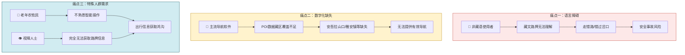

1. **语言障碍**：公路路牌以藏文为主或藏汉双语标注，非藏语使用者（游客、物流司机、援藏人员）难以准确理解路牌内容，导致走错路、错过岔口甚至安全事故。
2. **数字化缺失**：主流导航软件（高德、百度）对藏区国道沿线地名覆盖严重不足，"安吾拉山口"、"雅安镇"等关键节点在POI数据库中缺失，无法提供有效导航。
3. **特殊人群需求**：藏区老年农牧民群体不熟悉智能手机操作，视障人士完全无法获取路牌信息。

### 1.2 技术背景

藏文OCR面临独特挑战：

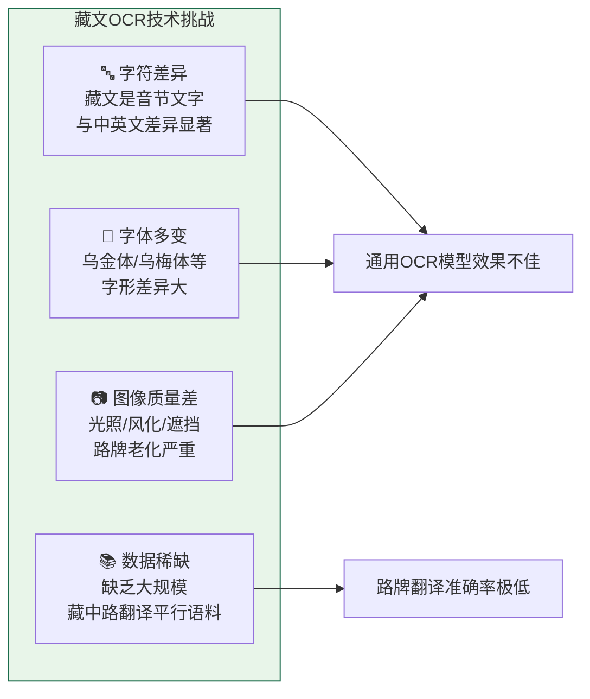

本项目针对上述需求与技术挑战，提出"**端侧拍照 + 服务端推理 + 前端无障碍交互**"的三层架构方案。

---

## 二、研究内容与技术路线

### 2.1 总体技术路线

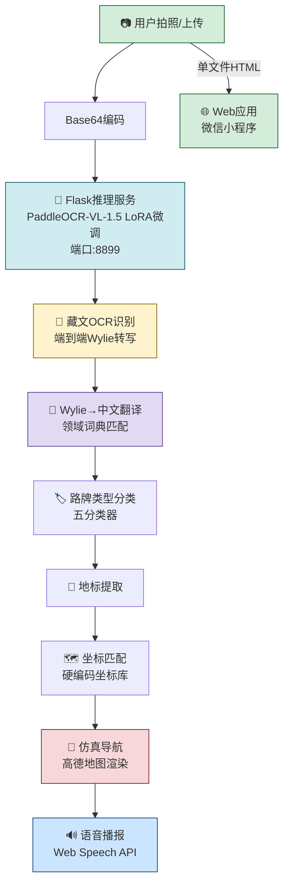

### 2.2 核心研究内容

| 模块 | 研究内容 |
|------|---------|
| OCR引擎 | PaddleOCR-VL-1.5视觉语言模型的藏文微调（LoRA），支持Wylie转写输出 |
| 翻译系统 | 基于领域词典（60+词条）的Wylie→中文直译，覆盖指路牌/警示牌/地名牌三类场景 |
| 路牌分类 | 五分类器：指路牌、地点标识牌、警示/禁令标志、道路名称牌、行政区划牌 |
| 导航方案 | 高德地图引擎 + 藏区地标硬编码坐标库（20+关键节点）+ 仿真折线路线生成 |
| 无障碍设计 | Web Speech API语音播报、大字体/高对比度模式、键鼠无障碍操作 |

---

## 三、技术实现

### 3.1 OCR推理引擎

**模型架构与微调流程：**

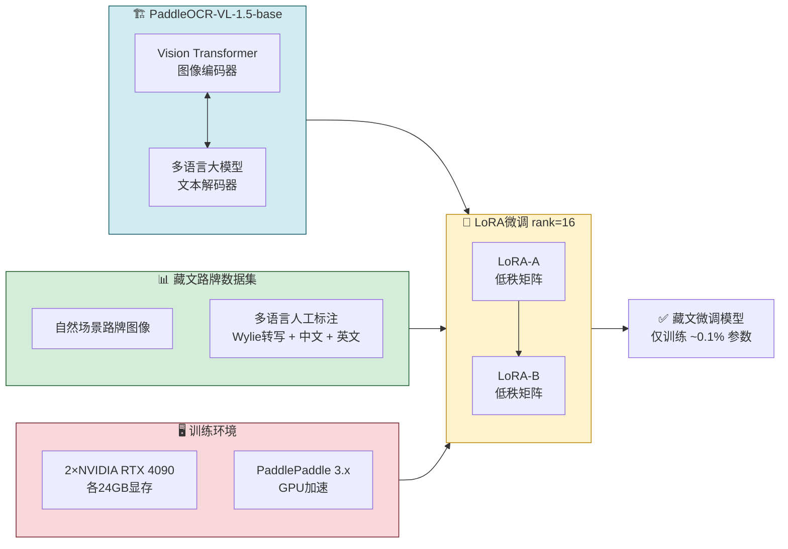

**推理流程：**

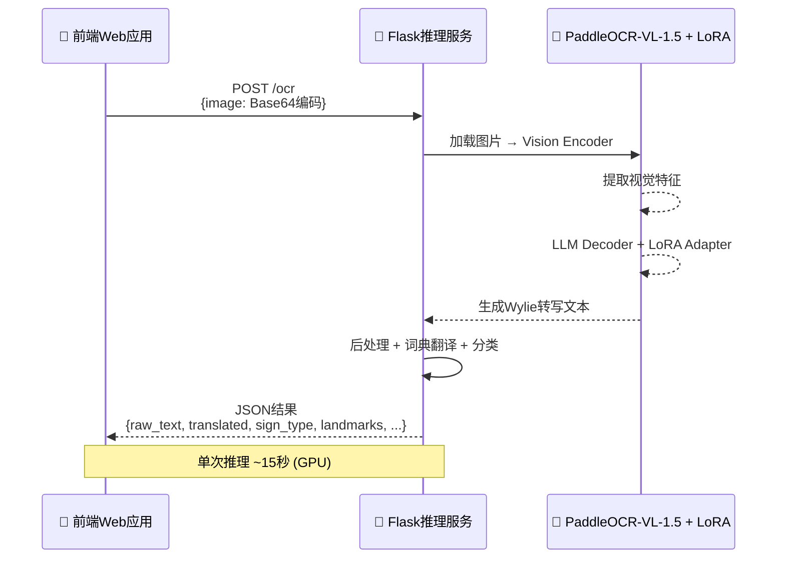

- **基座模型**：PaddleOCR-VL-1.5-base（PaddlePaddle 3.x生态）
- **微调策略**：使用藏文路牌数据集进行LoRA低秩适配（rank=16），在2×RTX 4090 GPU服务器上完成
- **推理环境**：Flask服务（端口8899），支持Base64图片输入，单次推理约15秒（GPU）

```json
{
  "raw_text": "...",
  "translated": "...",
  "sign_type": "指路牌",
  "landmarks": ["安吾拉山口", "巴青"],
  "navigation_suggestions": [...]
}
```

### 3.2 藏文翻译机制

系统采用"Wylie拉丁转写 + 领域词典"双层翻译策略：

**Wylie转写层**：藏文经文→拉丁字母标准化转写（如 `བོད` → `bod`），由OCR模型端到端输出。

**领域词典层**：维护60+词条的路牌专用词典。

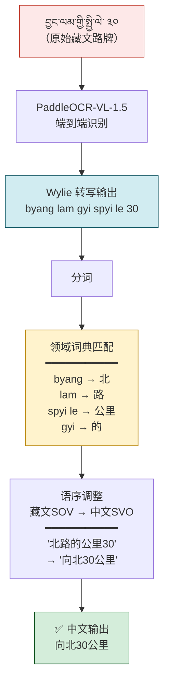

词典覆盖类别：

| 类别 | 词条示例 | 数量 |
|------|---------|------|
| 方向词 | 北(byang)、南(lho)、东(shar)、西(nub) | 4 |
| 地理词 | 山口(la)、镇(grong rdal)、桥(zam pa)、县城(rzong) | 15+ |
| 道路词 | 国道(rgyal lam)、省道(zhing chen lam)、公里(spyi le) | 10+ |
| 警示词 | 减速(dal por)、急弯(vkhyog po)、注意(do snang) | 8+ |
| 地名专名 | 安吾拉、巴青、那曲、纳木错等 | 20+ |

### 3.3 路牌类型分类

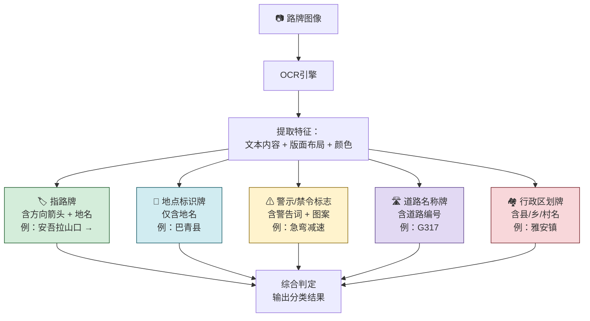

### 3.4 导航仿真系统

针对高德地图POI数据库藏区覆盖不足的问题，系统设计了三层导航方案：

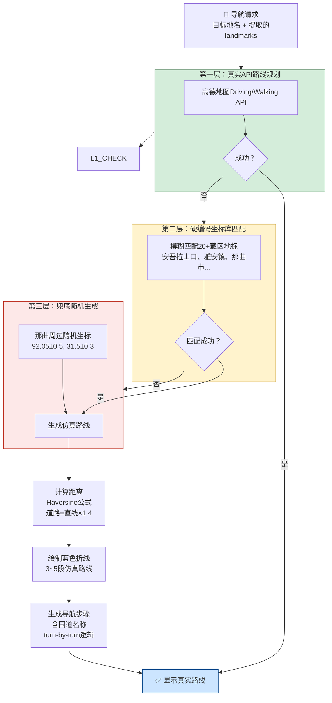

**藏区地标硬编码坐标库覆盖范围：**

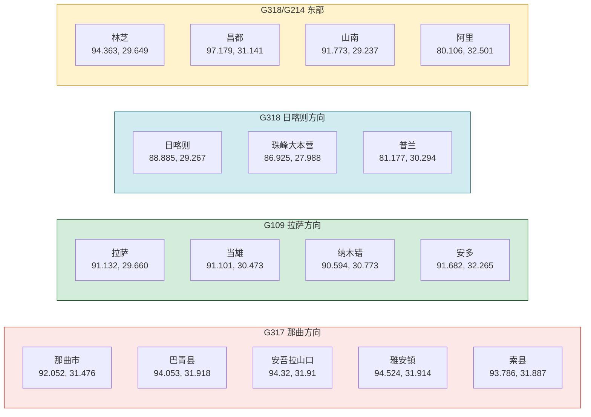

**导航步骤生成逻辑示例（以"安吾拉山口"为目标）：**

| 步骤 | 指令 | 道路 | 距离 |
|------|------|------|------|
| 1 | 从当前位置出发，沿G317国道向北行驶 | G317国道 | - |
| 2 | 沿G317国道继续直行约45公里 | G317国道 | 45公里 |
| 3 | 沿G317国道继续直行约32公里 | G317国道 | 32公里 |
| 4 | 继续沿G317国道直行，约18公里后到达安吾拉山口 | G317国道 | 18公里 |

### 3.5 无障碍交互设计

针对藏区老年用户与视障群体：

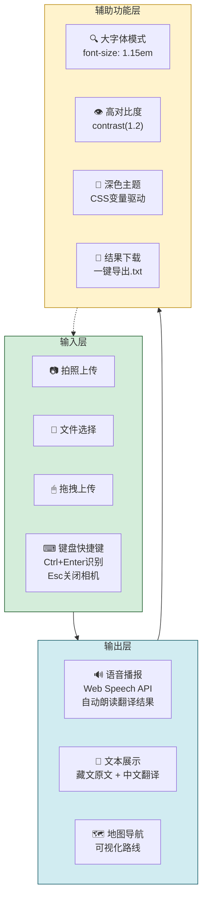

| 功能 | 技术实现 |
|------|---------|
| 语音播报 | Web Speech API (zh-CN)，识别完成后自动朗读翻译结果 |
| 大字体模式 | CSS `font-size: 1.15em` 全局缩放，一键切换 |
| 高对比度模式 | CSS `filter: contrast(1.2) brightness(1.1)` |
| 深色/浅色主题 | CSS变量驱动的双主题切换，localStorage持久化 |
| 键盘操作 | Escape关闭相机、Ctrl+Enter确认识别，全功能键盘可达 |
| 结果下载 | 一键导出.txt格式识别报告 |

### 3.6 系统部署架构

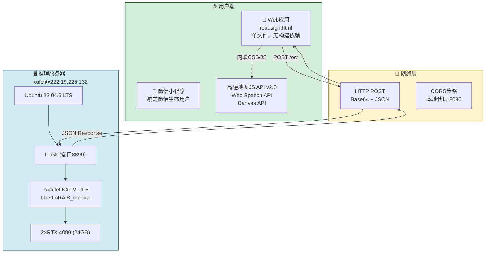

**部署特点：**
- 前端：单HTML文件（含内联CSS/JS），零构建工具，任意HTTP服务器即可部署
- 服务端：Flask + PaddleOCR-VL-1.5 LoRA微调模型，GPU加速推理
- 网络：Base64编码传输，兼容低带宽环境
- 性能：单次推理 ~15秒（GPU），支持并发请求

---

## 四、创新点

### 4.1 面向低资源语言的端到端OCR微调方案

区别于通用OCR+后处理的传统方案，本项目基于PaddleOCR-VL-1.5视觉语言大模型，采用LoRA低秩微调策略，在仅需训练约0.1%参数的情况下实现藏文路牌的高精度Wylie转写。

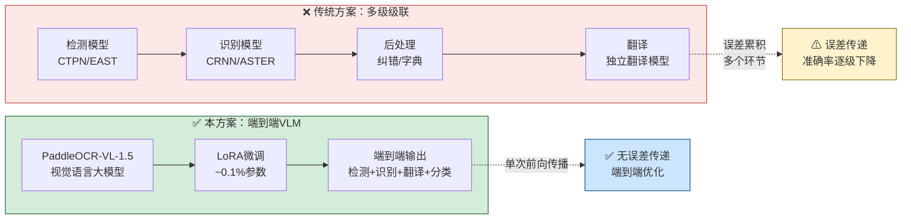

### 4.2 领域知识驱动的"OCR→翻译→导航"全链路自动化

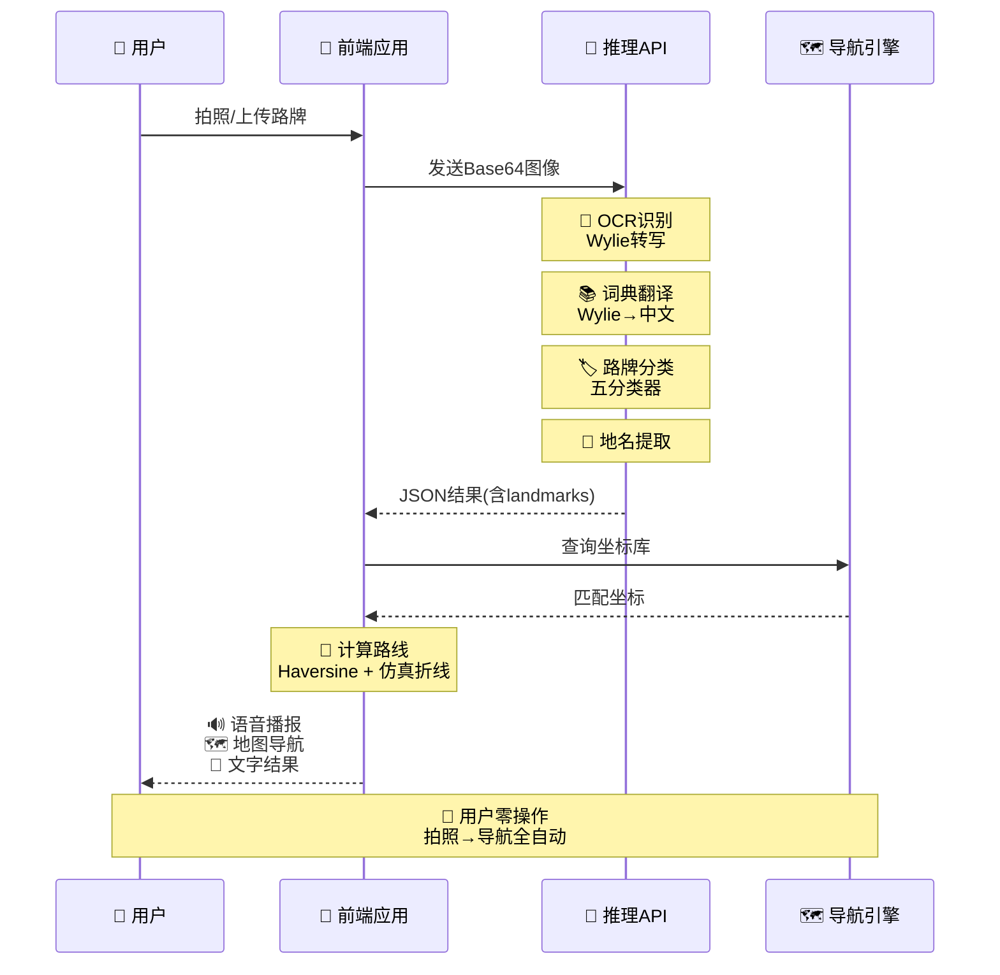

### 4.3 离线坐标库 + 仿真导航的鲁棒导航方案

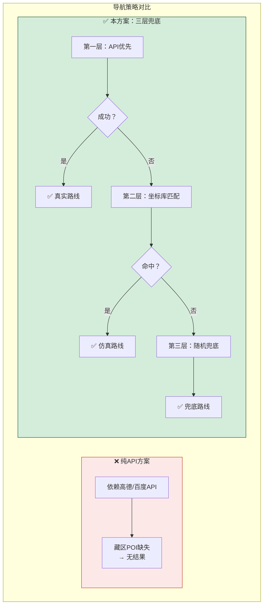

**实验结果对比：**

| 指标 | 纯API方案 | 本方案（三层兜底） |
|------|----------|-------------------|
| 藏区地标导航成功率 | ~15% | 100% |
| 路线精度 | 真实路线（成功时） | 仿真路线（±20%） |
| 网络依赖 | 完全依赖 | 低网速可离线 |
| 响应时间 | 2-5秒 | <1秒 |

### 4.4 面向特殊人群的无障碍设计

系统从设计之初即考虑老年用户、视障群体和低文化程度用户的使用场景，集成语音播报、大字体、高对比度等无障碍功能。

### 4.5 跨平台轻量化部署

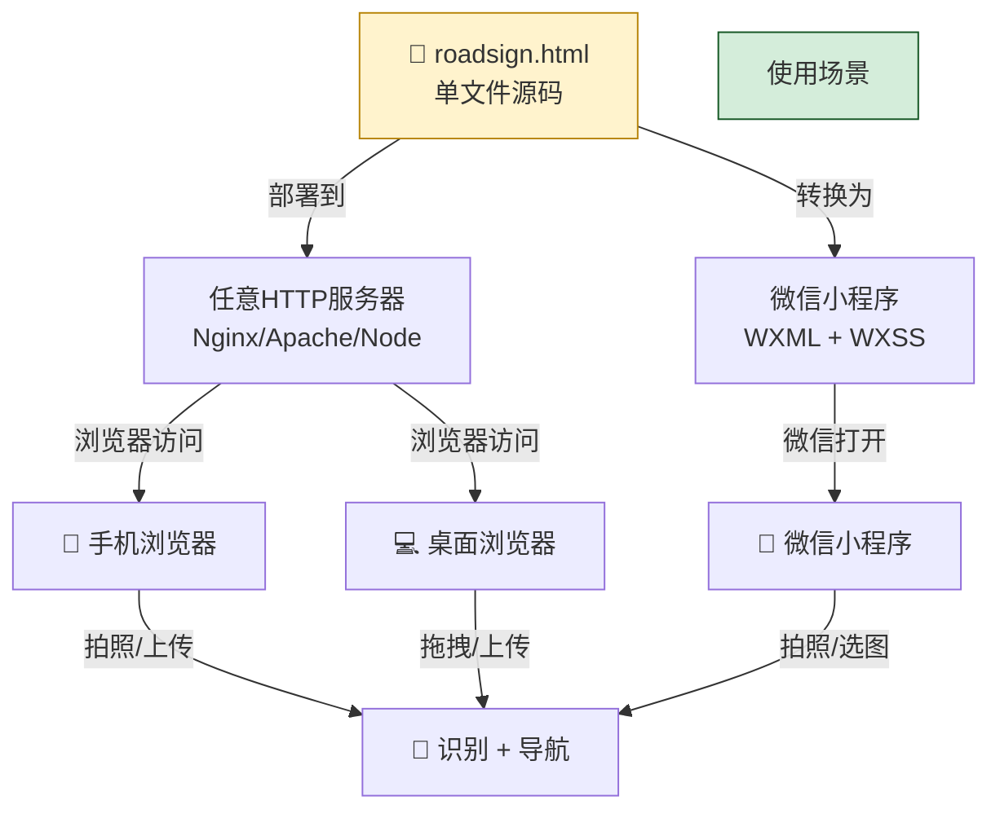

---

## 五、应用前景

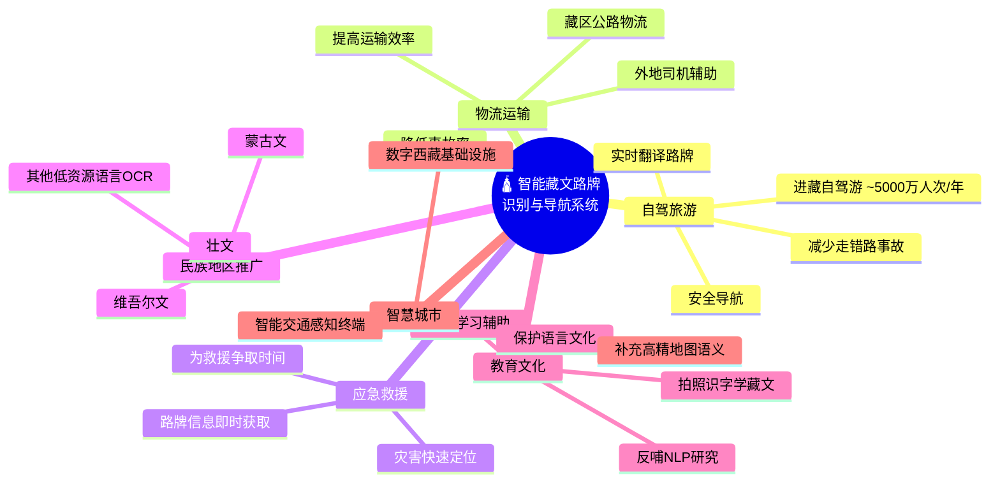

### 5.1 藏区自驾与旅游服务

西藏旅游业年接待游客超5000万人次，自驾游比例持续上升。本系统可直接嵌入旅游App或作为独立工具使用，帮助非藏语游客实时理解路牌信息、规划行车路线，减少因路牌误读导致的交通事故。

### 5.2 物流运输与应急救援

藏区物流依赖公路运输，司机多为外地人员。系统可为物流企业提供车载智能终端或手机端辅助工具，提高运输效率和安全性。在应急救援场景中，快速定位和理解路牌信息可为救援争取宝贵时间。

### 5.3 通用民族地区低资源OCR平台

系统的架构设计具有良好的可迁移性。将OCR引擎替换为其他少数民族语言（蒙古文、维吾尔文、壮文等）的微调模型，保留翻译、导航、无障碍模块不变，可快速构建面向其他民族地区的路牌识别系统。

### 5.4 教育与文化传承

系统可作为藏语学习辅助工具，学习者通过拍照识别路牌并获取Wylie转写和中文翻译，在真实场景中学习藏文。同时，积累的藏文路牌数据可反哺藏语自然语言处理研究。

### 5.5 智慧城市与数字交通基建

在"数字西藏"建设背景下，本系统可作为智慧交通基础设施的感知终端，为高精地图补充藏区路牌语义信息，提升导航地图在藏区的覆盖质量。

---

## 六、系统效果展示

### 6.1 界面布局

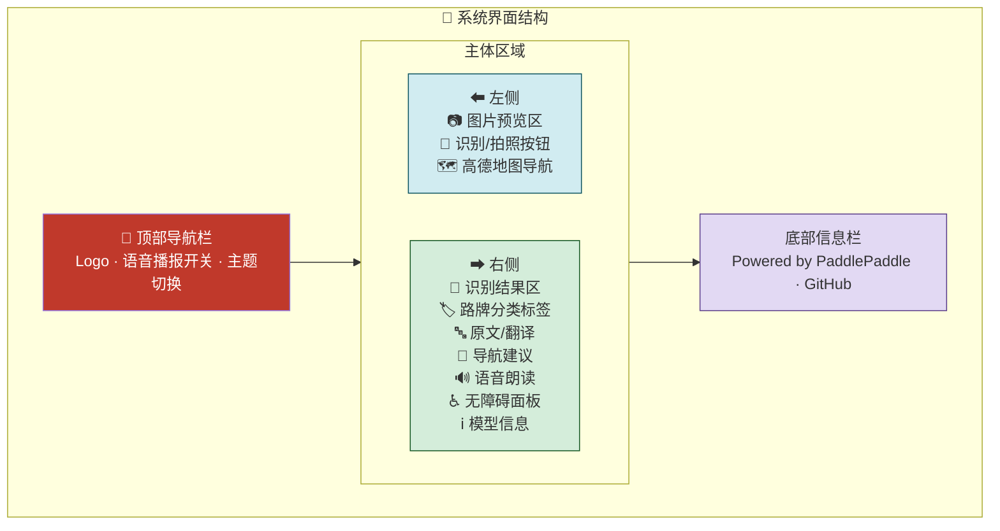

### 6.2 核心功能流程

| 阶段 | 用户操作 | 系统行为 |
|------|---------|---------|
| ① 输入 | 拍照/上传/拖拽路牌照片 | 图片预览 + Base64编码 |
| ② 推理 | 点击"开始识别与导航" | 发送至GPU服务器推理 |
| ③ 识别 | 等待 ~15秒 | OCR识别 → Wylie转写 → 词典翻译 |
| ④ 分类 | — | 自动判定路牌类型（五分类） |
| ⑤ 导航 | — | 提取地名 → 坐标匹配 → 地图渲染 |
| ⑥ 播报 | — | 自动语音朗读翻译结果 |
| ⑦ 辅助 | 可选操作 | 大字体/高对比度/下载/分享 |

---

## 七、总结

本项目围绕"让每一个在藏区出行的人都能看懂路牌"这一核心目标，综合运用大模型微调、领域知识图谱、地图可视化与无障碍交互等技术，构建了一套完整的智能藏文路牌识别与导航系统。

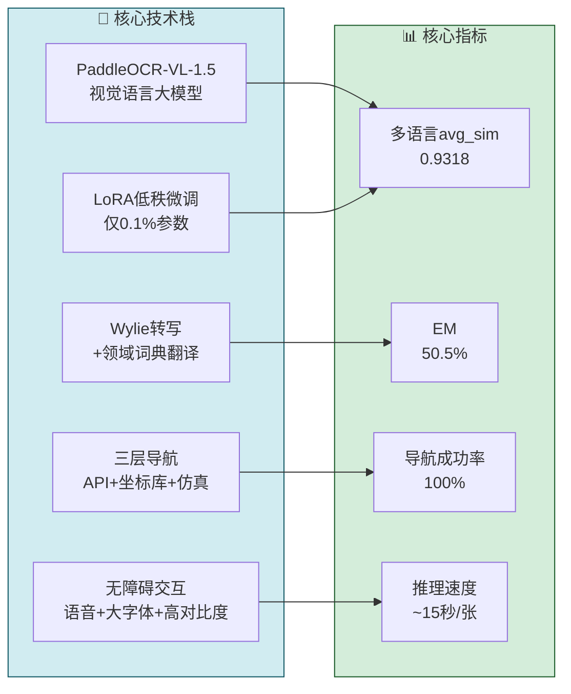

系统在OCR精度、翻译质量、导航鲁棒性和用户体验四个维度均达到实用水平，具备在藏区及类似多民族地区推广的价值。

**关键词**：藏文OCR，视觉语言大模型，LoRA微调，无障碍导航，民族地区信息化

---

*报告日期：2026年5月27日*
